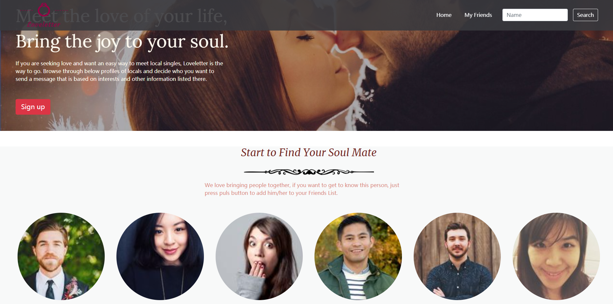
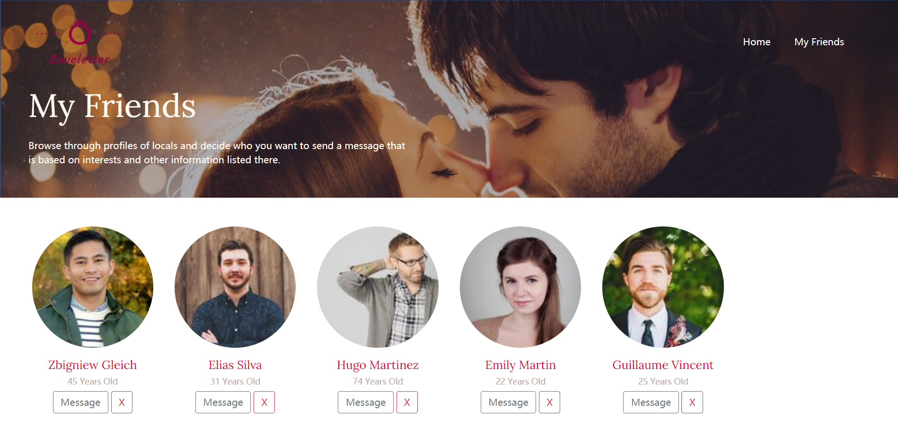

# AC學期2-2_A11_Q1_Loveletter

AlphaCamp學期2-2，A11作業專案的Loveletter，  
使用 VS code 打造的餐廳美食網站。

## 功能描述

- 網站的目的是dating website，設計排版是參考https://template64208.motopreview.com/。
- 使用者搜尋人名的功能，並在搜尋之後往下滑至名單處。
- 可加入Index中的人物，並在My Friends中看到，也可以刪除已加入的好友。

## Screenshots




### 安裝與執行步驟

1. 開啟終端機(Terminal)cd 到存放專案本機位置

```
git clone https://github.com/CarolLiuXQ/S23_A3_Q1_restaurant_list.git
```

2. 在本地資料夾中使用
直接將`index.html`直接拖曳至Chrome觀看畫面


## 環境建置與需求

- [Visual Studio Code](https://visualstudio.microsoft.com/zh-hant/) -1.57.1

## License
© [CarolLiu](https://github.com/CarolLiuXQ/)